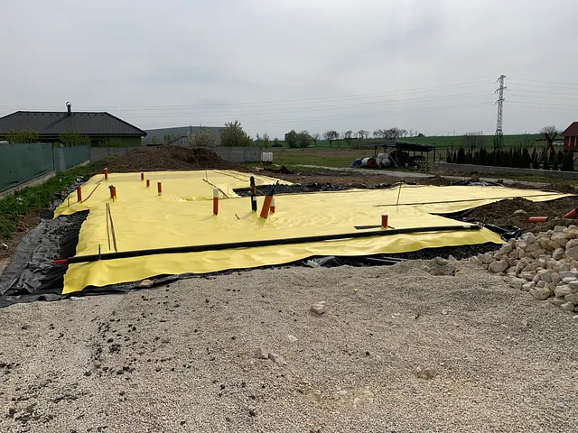
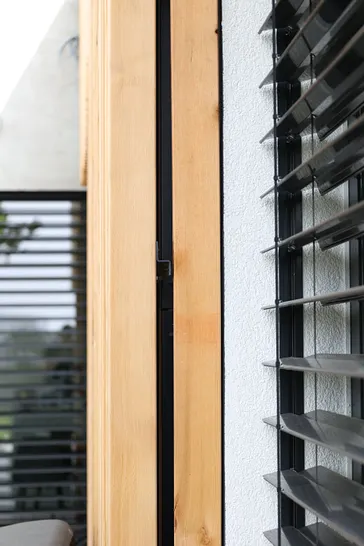
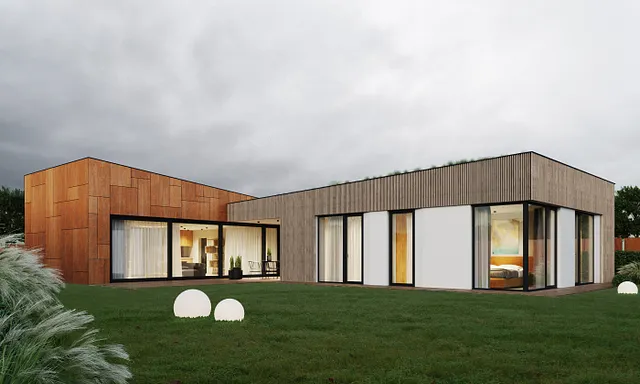
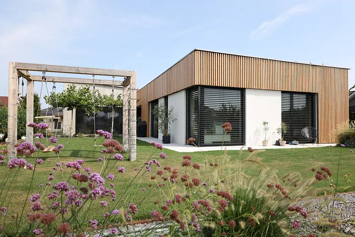
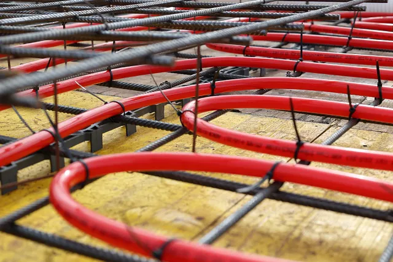
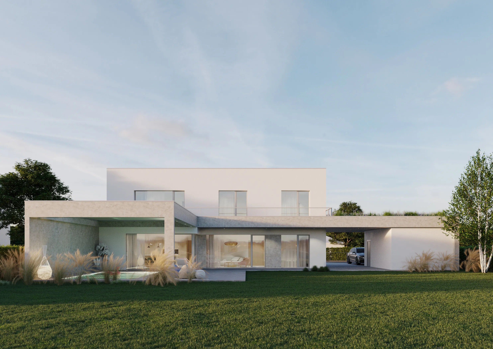

*Radi by sme sa s vami podelili o tri unikátne projekty z našej dielne, ktoré sú aktuálne v rôznych štádiách výstavby.*

## Dom s cortenom pri Piešťanoch

Zámerom klienta bolo vytvoriť jednopodlažné bývanie s moderným architektonickým výrazom. Keďže šírka pozemku bola vhodná skôr pre dvojpodlažný dom, návrh rieši komplexne jeho umiestnenie a dispozíciu, tak aby mali všetky izby kontakt so záhradou a dostatok solárnych ziskov. Architektúru domu definujú dve krídla, ktoré sú rozlíšené použitým obkladom. Obklad z cortenu, ktorý je výraznejším prvkom, akcentuje priečnu časť s hlavným obytným priestorom kuchyňo-obývačky. Súkromný pozdĺžny trakt s dreveným obkladom opticky chráni dvor od najbližšieho suseda a prechádza až do konštrukcie krytých parkovacích miest.

Rodinný dom je dokončený a máme veľkú radosť, že klienti si kvalitu nového bývania veľmi pochvaľujú. Maximálne prepojenie interiéru s exteriérom prostredníctvom veľkých presklení, ekologický zdroj tepla tepelné čerpadlo s hĺbkovým vrtom, prvotriedne technológie riadeného vetrania s rekuperáciou, stropného vykurovania a chladenia, výrazne moderná architektúra. To sú hlavné prednosti tejto naozaj vydarenej realizácie na ktorú sme hrdí.

Viac o tomto projekte sa dozviete tu: https://habitat.sk/projekty/dom-s-cortenom-pri-piestanoch/

<BlogImageRow>

</BlogImageRow>

## Dom s bazénom v Rusovciach

Návrh rodinného domu pracuje s tradičným tvaroslovím, nepopierajúc atmosféru lokality. Toto tvaroslovie kombinuje s modernými prvkami, ktoré sa objavujú napríklad v rôznej farebnosti omietok alebo využití nadštandardných presklení a konštrukcií ich tienenia.

Rodinný dom je navrhnutý ako jednopodlažný so sedlovou strechou. Tvar je prispôsobený rozsahu zadania a optimalizácii solárnych ziskov — L s orientáciou hlavných presklení na juho-západ. Dom má centrálnu dispozíciu, ktorá minimalizuje rozsah chodieb. Hlavný obytný priestor je orientovaný do záhrady, prepojený s exteriérom panoramatickým presklením s dvomi posuvnými krídlami. Priestor medzi ramenami dispozície je využitý na priestrannú terasu, prekrytú bioklimatickou pergolou. Tá vytvára svojimi otočnými lamelami príjemné pobytové prostredie počas celého roka a chráni veľké presklenia v lete pred nadmerným prehrievaním. Priamo z terasy je prístupný exteriérový bazén.

V súčasnosti sa dokončujú posledné sadové úpravy a čakáme na kolaudáciu. Klienti sa pripravujú na sťahovanie do nového domu, ktorý je navrhnutý presne podľa ich predstáv, a zrealizovaný v súlade s našimi najvyššími kritériami na kvalitu. Skúškou správnosti stavby je blower door test kde tento dom obstál na výbornú.

Viac o tomto projekte sa dozviete tu: https://habitat.sk/projekty/dom-s-bazenom-v-rusovciach/

<BlogImageRow>

</BlogImageRow>

<BlogImageRow>

</BlogImageRow>

## Moderná vila v Rusovciach

Vila svojou výškou a tvarom nadväzuje na susednú zástavbu. Dve plné podlažia a kompaktné usporiadanie vykurovaných priestorov domu vytvárajú skvelý koncept pre stavbu v pasívnom štandarde. Táto jednoduchá hmota je doplnená o samostatne stojacu garáž, prekrytie vstupu nadväzujúce na balkón a konštrukciu bioklimatickej pergoly. Všetky tieto prvky sú mimo tepelnej obálky domu a umožňujú rozohrať architektúru bez vplyvu na energetickú úsporu.

Veľké presklenia prepájajúce terasu s obývačkou sú chránené pred letným slnkom konštrukciou balkóna, na oknách na druhom nadzemnom podlaží sú proti prehrievaniu navrhnuté exteriérové žalúzie.

Tento projekt je práve vo výstavbe. Máme osadené hliníkové okná na predsadenú montáž, v stropnej doske sú zaliate rozvody vzduchotechniky a stropného chladenia. Aktuálne sa dokončujú vnútorné rozvody. Na dodržaní projektovej dokumentácie a kvalite zhotovenia si dávame záležať. Vďaka použitiu materiálov s vysokou tepelnou akumuláciou, chránených kvalitnou spojitou tepelnoizolačnou obálkou a efektívneho tienenia bude mať dom výbornú teplotnú stabilitu v mrazoch aj letných horúčavách. Moderné technologické vybavenie domu zabezpečí najvyššiu kvalitu vnútorného prostredia a efektívnu prevádzku s minimálnymi nákladmi. Tešíme sa na dokončenie a sme si istí, že klient bude s výsledkom nad očakávania spokojný.

Viac o tomto projekte sa dozviete tu: https://habitat.sk/projekty/moderna-vila-v-rusovciach/

<BlogImageRow>

</BlogImageRow>