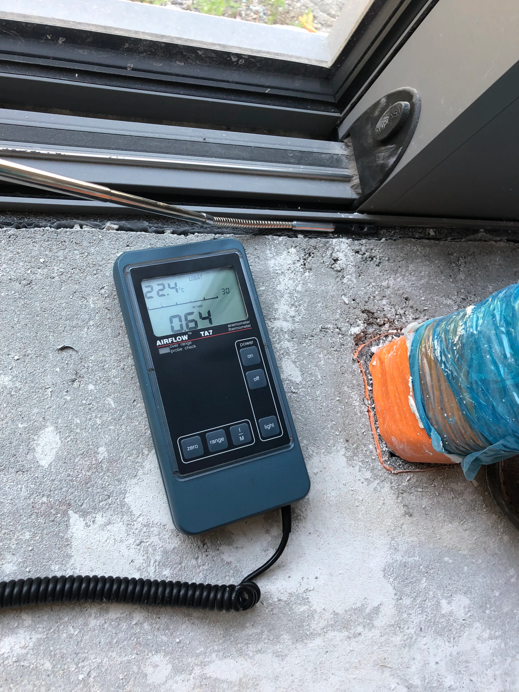
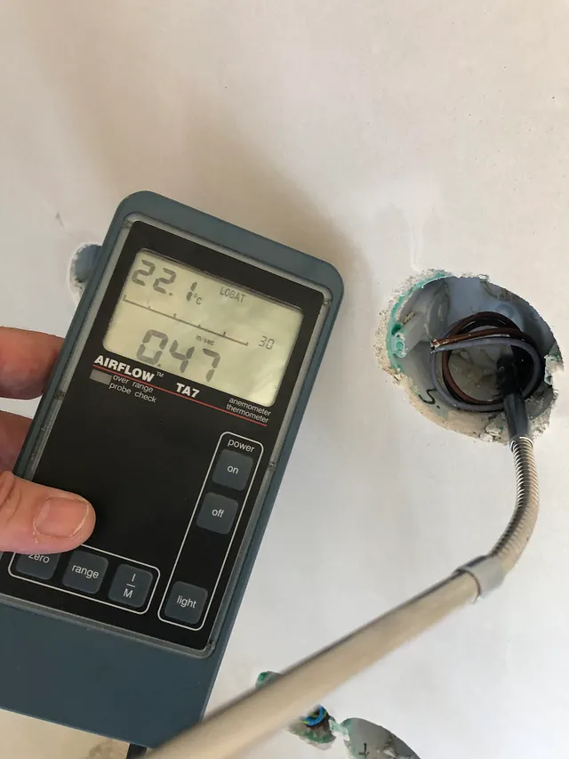
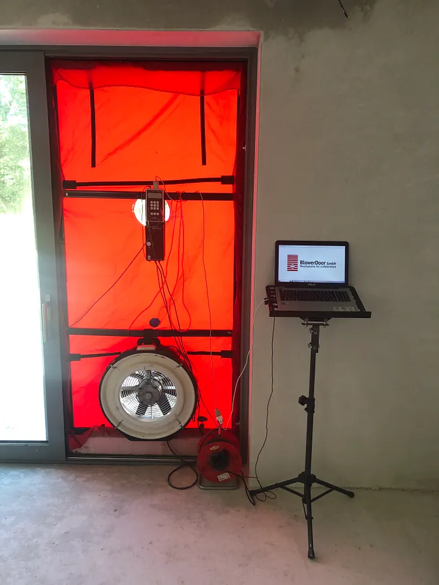

*V nasledujúcom príspevku si bližšie povieme, či treba mať zo vzduchotesnosti obavy alebo nie, čo to vlastne je, ako ju dosiahnuť a aj to ako sa dá zmerať.*

## Časté obavy zo vzduchotesnosti domu

Vzduchotesnosť stavby je pre mnohých stavebníkov a majiteľov domov stále témou, ktorá vzbudzuje obavy. Často sa stretávame s otázkami ako: „Nebude mať vzduchotesný dom stále vydýchaný vzduch?“ alebo „Nebudem mať problémy s plesňami?“. Bežne sa stretávame s názorom: „Dom musí dýchať, a nie byť zaizolovaný ako v igelitke“. Ľudia si vzduchotesnosť spájajú s nekomfortným prostredím, kde sa neobmieňa vzduch, čo vyvoláva strach z uzavretého a dusného priestoru. Navyše, predstava „utesneného“ domu môže byť pre niekoho synonymom neschopnosti domu dýchať. Tieto obavy však často vychádzajú z nedostatočných informácií a nesprávneho chápania problematiky.

## Súvislosti a fakty o vzduchotesnosti

Vzduchotesnosť stavby je v skutočnosti jedným z kľúčových prvkov modernej a energeticky efektívnej architektúry. Dobre utesnený dom neznamená, že vzduch sa v ňom nebude vetrať. V skutočnosti sa kontrolovaná výmena vzduchu rieši cez ventilačné systémy, ktoré zabezpečujú neustálu obnovu čerstvého vzduchu bez toho, aby došlo k nekontrolovaným únikom tepla. Funguje to podobne ako ľudské pľúca. Človek tiež nedýcha celou pokožkou, ale len orgánom na to určeným. Pľúcami domu je vetracia jednotka s rekuperáciou. Vzduchotesnosť eliminuje tepelné straty spôsobené prievanom a „neviditeľnými“ škárami v konštrukcii. Tým výrazne prispieva k zlepšeniu energetickej účinnosti domu a k zvýšeniu komfortu obyvateľov. Dôležité je teda uvedomiť si, že vzduchotesnosť nie je prekážkou, ale podmienkou pre zdravé, ekonomické a udržateľné bývanie.

## Opatrenia na dosiahnutie vzduchotesnosti domu

Aby sme dosiahli optimálnu vzduchotesnosť, je potrebné vykonať niekoľko konkrétnych opatrení počas samotnej výstavby, ale aj v projekcii. V prvom rade je nevyhnutné precízne spracovanie detailov s dôrazom na spojitosť vzduchotesnej roviny v konštrukciách. Rizikové sú najmä miesta konštrukčných spojov a prestupov, ako sú spoje múrov, stropov, trámov či strechy, pretože práve tieto miesta sú najčastejšie zdrojom netesností. Dôležitým prvkom sú kvalitné vzduchotesné fólie a pásky, ktoré sa používajú na utesnenie konštrukcií a spojov. V prípade montáže okien a dverí je nevyhnutné dôsledné zaizolovanie pripájacej škáry medzi rámom a stenou. Rovnako je dôležité vzduchotesne realizovať elektroinštalácie, prestupy potrubí a ďalšie technologické prvky, ktoré môžu byť zdrojom prieniku vzduchu, ak nie sú správne utesnené.

<BlogImageRow>

</BlogImageRow>

## Kontrola vzduchotesnosti: Blower Door test

Ak chcete skontrolovať, ako vzduchotesná je vaša stavba, najlepšou metódou je tzv. Blower Door test. Pri výstavbe pasívnych domov je tento test „povinnou jazdou“ a zároveň slúži ako skúška správnosti (kvality) stavby. Ide o štandardizované meranie, ktoré dokáže presne určiť úroveň vzduchotesnosti domu. Meria sa pomocou ventilátora, ktorý sa nainštaluje do otvoru vo fasáde, najčastejšie vstupných dverí. Ventilátor vytvorí v dome podtlak alebo pretlak a následne sa meria množstvo vzduchu, ktoré prenikne cez netesnosti v obvodovej konštrukcii. Výsledok testu je vyjadrený hodnotou n50, ktorá hovorí o počte výmen vzduchu za hodinu pri rozdiele tlakov 50 Pa. Podtlak a pretlak 50 Pa simuluje tlak a sanie vetra na náveternej a záveternej fasáde, pri rýchlosti vzduchu 9m/s (32km/h). Čím je číslo hodnoty n50 nižšie, tým je dom vzduchotesnejší. Pre pasívne domy je podmienkou hodnota menšia alebo rovná ako 0.6. Pri rekonštrukcii do pasívneho štandardu je limit 1,0. Toto overenie odhaľuje aj najmenšie netesnosti, ktoré by inak neboli viditeľné, a umožňuje ich dodatočnú opravu. Aby bola oprava rýchla a efektívna, odporúčame vykonať Blower Door test hneď po uzavretí vzduchotesnej roviny. Netesnosti sú vtedy ešte ľahko prístupné. Finálny blower door test, ktorý sa realizuje po dokončení stavby vrátane interiéru je určený na stanovenie konečnej hodnoty neprievzdušnosti stavby.

## Záverečné zhrnutie

Vzduchotesnosť stavby je často vnímaná ako zbytočný alebo dokonca škodlivý prvok. Skutočnosť je však iná — správne zrealizovaná vzduchotesnosť je nevyhnutným predpokladom pre energeticky efektívny a komfortný dom. Obavy z „dusného“ prostredia sú neopodstatnené, ak je zabezpečená kvalitná ventilácia. Vhodnými opatreniami počas výstavby a kontrolou pomocou Blower Door testu je možné dosiahnuť vysoký štandard vzduchotesnosti a tým výrazne znížiť energetickú náročnosť domu. Namiesto strašiaka by sa mala vzduchotesnosť stať cieľom každého, kto chce bývať v úspornom a komfortnom dome.